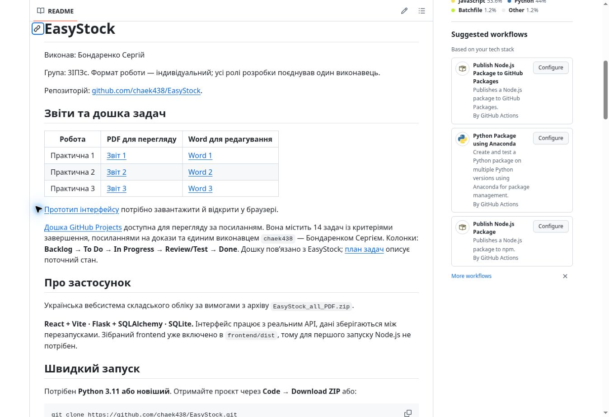
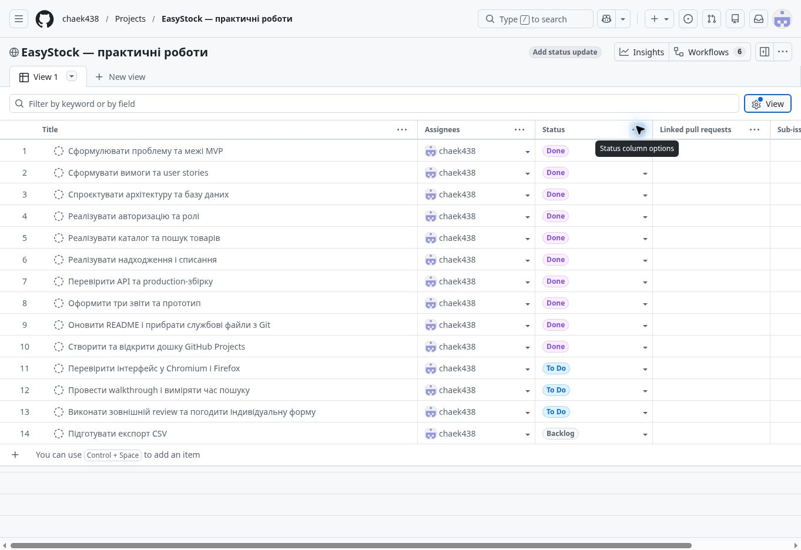
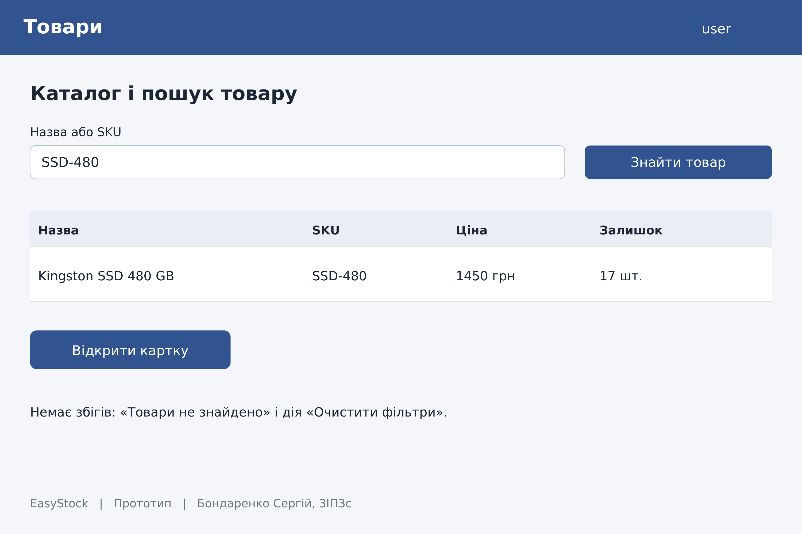
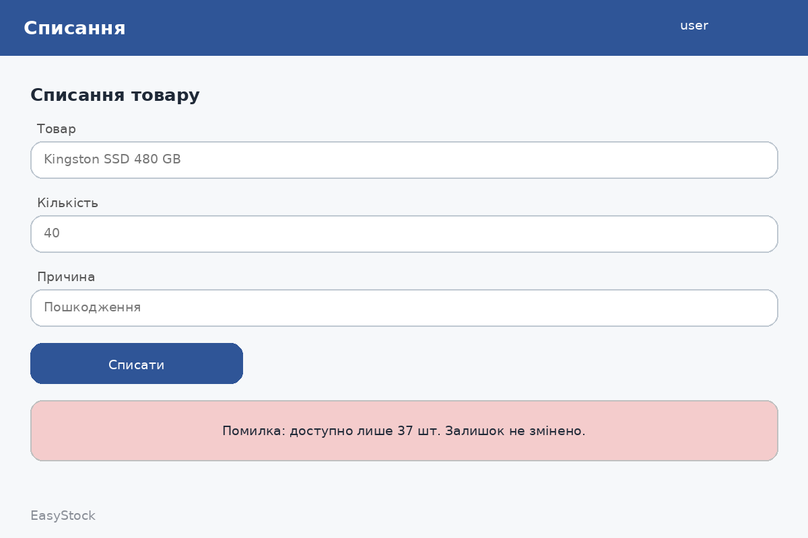

# EasyStock

Виконав: Бондаренко Сергій

Група: 3ІПЗс. Формат роботи — індивідуальний; усі ролі розробки поєднував один виконавець.

Репозиторій: [github.com/chaek438/EasyStock](https://github.com/chaek438/EasyStock).

## Звіти та дошка задач

| Робота | PDF для перегляду | Word для редагування |
| --- | --- | --- |
| Практична 1 | [Звіт 1](docs/Lab1/Report.pdf) | [Word 1](docs/Lab1/Report.docx) |
| Практична 2 | [Звіт 2](docs/Lab2/Report.pdf) | [Word 2](docs/Lab2/Report.docx) |
| Практична 3 | [Звіт 3](docs/Lab3/Report.pdf) | [Word 3](docs/Lab3/Report.docx) |

[Прототип інтерфейсу](docs/Lab3/prototype.html) потрібно завантажити й відкрити у браузері.

[Дошка GitHub Projects](https://github.com/users/chaek438/projects/2/views/1) доступна для перегляду за посиланням. Вона містить 14 задач із критеріями завершення, посиланнями на докази та єдиним виконавцем `chaek438` — Бондаренком Сергієм. Колонки: **Backlog → To Do → In Progress → Review/Test → Done**. Дошку пов’язано з EasyStock; [план задач](docs/PROJECT_BOARD.md) описує поточний стан.

## Скріншоти та прототип

[Усі зображення з описами](docs/screenshots/README.md). У трьох звітах Word і PDF додано скріншоти опублікованих матеріалів GitHub із підписами та посиланнями на джерела.

### Репозиторій та задачі





### Статичні екрани прототипу

Це навчальні ескізи з клікабельного прототипу. Скріншоти запущеного EasyStock потрібно додати після локального демопрогону.





## Про застосунок

Українська вебсистема складського обліку за вимогами з архіву `EasyStock_all_PDF.zip`.

**React + Vite · Flask + SQLAlchemy · SQLite.** Інтерфейс працює з реальним API, дані зберігаються між перезапусками. Зібраний frontend уже включено в `frontend/dist`, тому для першого запуску Node.js не потрібен.

## Швидкий запуск

Потрібен **Python 3.11 або новіший**. Отримайте проєкт через **Code → Download ZIP** або:

```bash
git clone https://github.com/chaek438/EasyStock.git
cd EasyStock
```

Під час завантаження ZIP розпакуйте його повністю. Відкрийте папку, у якій міститься `start.py`.

### Windows

Двічі натисніть **`run_demo.bat`** у папці EasyStock. Після встановлення залежностей відкрийте **http://127.0.0.1:5000**. Якщо команда `python` недоступна, встановіть Python з опцією «Add Python to PATH».

### Linux / macOS

```bash
bash run_demo.sh
```

Відкрийте **http://127.0.0.1:5000**. Для зупинки натисніть Ctrl+C у терміналі.

### Ручний запуск

```bash
python -m venv .venv
```

Windows PowerShell:

```powershell
.venv\Scripts\python.exe -m pip install -r backend\requirements.txt
.venv\Scripts\python.exe start.py --demo
```

Linux / macOS:

```bash
.venv/bin/python -m pip install -r backend/requirements.txt
.venv/bin/python start.py --demo
```

Перший запуск `--demo` створює `database/easystock.db`, 12 товарів, категорії, постачальників та демонстраційну історію. Повторний запуск зберігає існуючі дані. Паролі зберігаються як scrypt-хеші. Не видаляйте БД, якщо потрібні ваші зміни.

## Демонстраційні облікові записи

Спільний пароль: **`DemoStock2026!`**. Кнопки ролей на сторінці входу заповнюють поля; для входу натисніть «Увійти в систему».

| Email | Роль | Доступ |
|---|---|---|
| admin@easystock.local | Адміністратор | Усі функції, довідники та користувачі |
| keeper@easystock.local | Комірник | Перегляд, надходження, списання, історія |
| manager@easystock.local | Менеджер | Перегляд товарів, залишків, історії та довідників |

## Функції

- Вхід, серверні сеанси на 8 годин, вихід з відкликанням сеансу, рольовий контроль API, CSRF-захист.
- Огляд складу: товарні позиції, кількість, вартість запасів, товари для поповнення, рух за 7 днів, останні операції.
- Товари: створення, редагування, архівація без видалення історії; пошук за назвою/SKU, категорією та залишком; пагінація.
- Картка товару: поточний та мінімальний залишок, ціна, постачальник, історія.
- Надходження: до 50 позицій у документі, постачальник, закупівельна ціна, коментар, нові залишки.
- Списання: перевірка доступної кількості в SQL; негативний результат зберігає введені поля.
- Історія: автор, час, тип, кількість, залишок після операції, номер надходження, коментар, пошук і фільтри дат.
- Категорії та постачальники: CRUD для адміністратора. Видалення заборонено, якщо є посилання.
- Користувачі: створення, зміна ролі та пароля, блокування. Не можна позбавити себе прав адміністратора.
- Адаптивне меню, мобільний інтерфейс, loading/error/empty/success-стани.

Ціна товару використовується для поточної оцінки запасів. Закупівельна ціна записується в документ надходження та не перезаписує ціну каталогу. Одиниці виміру довільні, кількість у MVP завжди ціла.

## Сценарій для захисту

1. Увійти як комірник.
2. Відкрити «Товари», знайти `SSD-480` (початковий залишок **17**).
3. Відкрити картку, натиснути «Надходження», ввести **20**, підтвердити: залишок **37**.
4. Перейти до історії: видно надходження, автора й час.
5. У картці відкрити «Списання», ввести **40**: помилка, залишок **37**, поля збережені.
6. Ввести **3**: списання успішне, залишок **34**.
7. Вийти, увійти як менеджер: складські операції та керування користувачами недоступні.

Початкові цифри сценарію застосовуються до свіжої демобази. Проєкт опубліковано в цьому GitHub-репозиторії. У звітах інтерв’ю позначені як змодельовані сесії, review — як самоперевірка. Незалежний walkthrough, вимірювання часу пошуку людиною та повний прогін у Chromium/Firefox ще потрібно виконати. Автоматизовані перевірки описані в `docs/TESTING.md`.

## Розробка

Для перескладання інтерфейсу потрібен **Node.js 22.12+** та npm.

```bash
cd frontend
npm ci
npm run build
```

Режим розробки: у двох терміналах, із кореня проєкту:

```bash
# Backend (Linux/macOS; Windows: .venv\Scripts\python.exe)
.venv/bin/python -m flask --app backend/app run --port 5000
# Frontend
cd frontend
npm run dev
```

Відкрийте адресу Vite (зазвичай http://127.0.0.1:5173). Vite проксіює `/api` на Flask. Не змішуйте `localhost` і `127.0.0.1` під час роботи з cookies.

## Тести

З кореня EasyStock:

```bash
.venv/bin/python -m pytest -q
# Windows: .venv\Scripts\python.exe -m pytest -q
```

Тестова БД створюється у тимчасовій папці та не змінює вашу робочу базу.

React DOM-тест перевіряє форми з реальним API (сервер має працювати):

```bash
cd frontend
npm ci
npm run test:ui
```

Браузерні тести запускаються проти працюючого **демосервера**:

```bash
cd frontend
npm ci
npx playwright install chromium firefox
npm run test:e2e
```

DOM- і браузерні тести додають окремі товари `React DOM …` / `E2E …`, проводять операції та архівують їх. Запускайте їх на окремій тестовій БД, якщо історію робочого складу потрібно зберегти чистою. Адресу можна задати змінною `EASYSTOCK_URL`.

## Чиста база без демо

Не запускайте `--demo`. Для створення адміністратора на порожній БД:

```bash
.venv/bin/python -m flask --app backend/app create-admin
.venv/bin/python start.py
```

Для окремої БД встановіть `DATABASE_URL=sqlite:////absolute/path/new.db` (на Windows: `sqlite:///C:/path/new.db`). При зміні структури моделей для існуючої бази потрібні міграції; `create_all` не змінює наявні таблиці.

## Структура

```text
EasyStock/
  backend/easystock/      моделі, авторизація, REST API, Stock Service
  frontend/src/          React-інтерфейс та стилі
  frontend/dist/         готовий інтерфейс для запуску
  database/schema.sql    схема БД; робоча БД створюється при запуску
  tests/                 API, транзакції, паралельні списання, браузерні тести
  docs/Lab1..Lab3/        вихідні звіти та артефакти реалізації
  docs/adr/              архітектурні рішення
  docs/API.md            контракт API
  docs/EasyStock.postman_collection.json   колекція API-запитів
  docs/TESTING.md         результати перевірок
  start.py               сервер Waitress
```

## Локальний MVP та розгортання

Локально використовується HTTP на 127.0.0.1. Для зовнішнього доступу потрібні HTTPS/reverse proxy, `COOKIE_SECURE=1`, власні облікові записи, резервні копії та постійний диск для SQLite. Rate limiter входу працює в пам’яті одного процесу; для кількох процесів потрібне спільне сховище. Немає оплат, AI, Telegram, email-інтеграцій, мобільного застосунку, сканера штрихкодів або експорту CSV: вони поза обов’язковим MVP.

Документація вимог відповідає наданим PDF. Схема, код і тести є фактичними артефактами реалізації. Тести не замінюють інтерв’ю чи usability review іншою людиною.


## Службові файли та стан перевірки

`.gitignore` виключає локальні SQLite-бази, WAL/SHM, кеш Python, віртуальні середовища та `node_modules`. Схема `database/schema.sql`, demo seed і готовий `frontend/dist` залишаються в репозиторії. При першому запуску `--demo` база створюється автоматично.

Робочу БД, WAL/SHM і сім файлів кешу Python уже прибрано з поточної версії `main`. Для старих локальних Git-копій є `scripts/cleanup_git.bat` (Windows) і `scripts/cleanup_git.sh` (Linux/macOS). Вони прибирають службові файли з індексу та залишають локальні копії на комп’ютері. Попередні коміти збережено в історії Git. Докладні кроки для наступних оновлень: [оновлення GitHub](docs/GITHUB_UPDATE.md).

На перевіреному коміті `8e8a046cee0458019c044e6ca58ae753e6eadadf` пройшли 39 тестів API та production-збірка Vite. Цей результат стосується коду в зазначеній версії. Він не підтверджує незалежне тестування інтерфейсу людиною.
